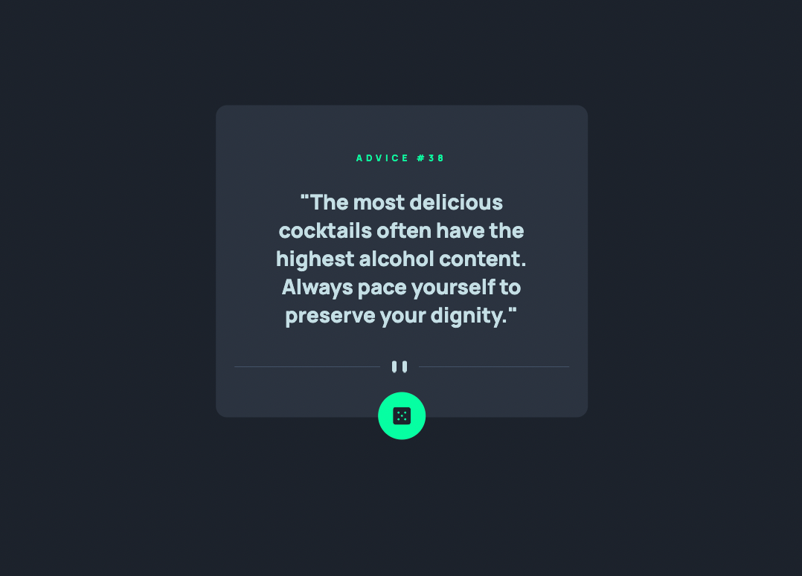

# Frontend Mentor - Advice generator app solution

This is a solution to the [Advice generator app challenge on Frontend Mentor](https://www.frontendmentor.io/challenges/advice-generator-app-QdUG-13db). Frontend Mentor challenges help you improve your coding skills by building realistic projects.

Live Site available down below!

## Table of contents

- [Overview](#overview)
  - [The challenge](#the-challenge)
  - [Screenshot](#screenshot)
  - [Links](#links)
- [My process](#my-process)
  - [Built with](#built-with)
  - [What I learned](#what-i-learned)
  - [Continued development](#continued-development)
  - [Useful resources](#useful-resources)

**Note: Delete this note and update the table of contents based on what sections you keep.**

## Overview

### The challenge

Users should be able to:

- Get random bits of advice whenever they want (when they're connected to the internet)

- Get a new random bit of advice when they're done digesting the current one.

### Screenshot



### Links

- Live Site URL: [Here it is!](https://gentle-earth-70051.herokuapp.com/)

## My process

- My process was to first establish a connection to the Advice API using my code. This meant console logging an advice slip object with the help of the documentation on the website.

- After logging the object to the console, I designed a basic HTML structure using what I know about how the Advice Slip Object is structured.

- I connected the relevant elements with the advice slip object such that pressing the button would generate a new advice slip and display the information correctly

- Once I had connected the API to the elements in a way that made sense to me, I began styling the page to match the design provided by FrontendMentor.

- I am now deploying it to Heroku.

- My next steps will be to make the design responsive to Mobile Users.

### Built with

- Semantic HTML5 markup
- CSS custom properties
- Flexbox
- Javascript
- [Advice Slip API](https://api.adviceslip.com) 


**Note: These are just examples. Delete this note and replace the list above with your own choices**

### What I learned

I learned how to connect an API with HTML elements. I used the Fetch API present in the browser's Javascript Engine to make the calls.

```css
.new-advice:hover {
  transition: all 0.5s ease-in-out;
  box-shadow: 
  0 0 5px 5px var(--neonGreen);
}
```
I'm quite proud of this CSS hover animation. When you hover the mouse over the `new-advice` button, it slowly glows green over the duration of `0.5s`.
I'm still trying to figure out how to reverse the animation when the mouse hovers off. I've tried using the same transition attribute on the original element's styling, however that makes a new erroneous animation when the element loads.

### Continued development

- My CSS is not as responsive as I'd like. I'll be making it more responsive to the length of the advice body. Some advice is really short but some advice can run on longer than expected. The box is currently big enough to accomodate the biggest string I've seen so far, however I can't get it to change height depending on the length of the text. This would be a game changer.

- I'd like to write cleaner CSS. Currently I think some redundant lines of CSS are in my stylesheet.

- Soon I'll make the website responsive to mobile phones.

### Useful resources

- [CSS Glow](https://superdevresources.com/css-button-glow-effect/) - This is where I learned about how to do a glow effect on CSS. Yes it's true - just make a box shadow the same colour as the element!

- [Responsive Web Design](https://www.freecodecamp.org/learn/responsive-web-design/) - Sorry for the long tutorial but this really helped me understand HTML and CSS. There is a lot going on here. By far the hardest part of this project is the CSS!


